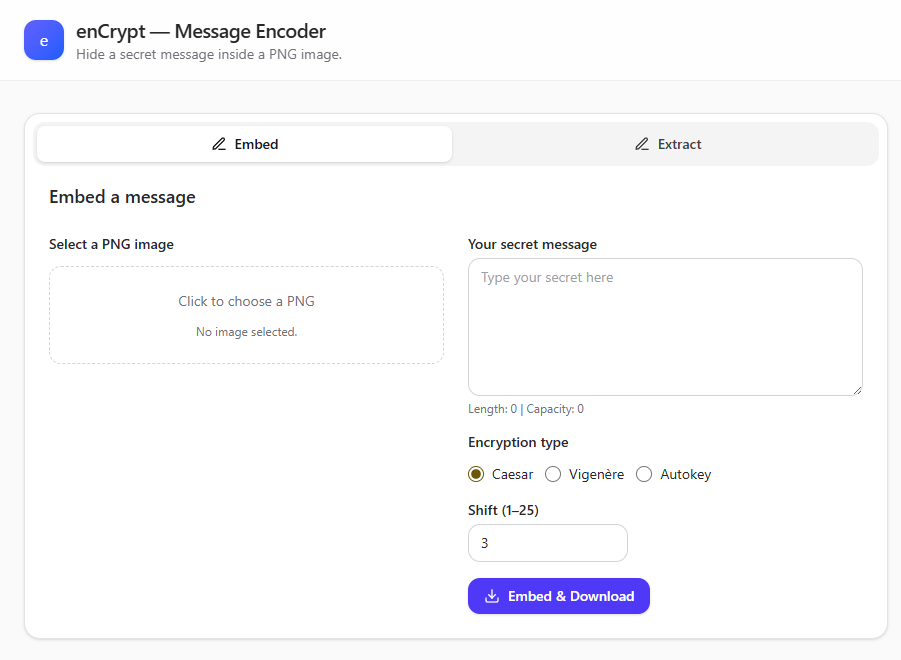

# enCrypt

**enCrypt** is a web-based utility that allows you to securely hide secret messages within PNG images using steganography. It provides an extra layer of security by encrypting your message with one of three different classical cipher methods before embedding it into the image data. You can then share the image, and the intended recipient can use enCrypt to extract and decrypt the hidden message.

 

---

## ✨ Features

-   **Two Main Modes**:
    -   **Embed**: Hide your secret message inside a PNG image.
    -   **Extract**: Retrieve a hidden message from a modified PNG image.
-   **Client-Side Operation**: All processing is done directly in your browser. Your images and messages are never uploaded to a server, ensuring complete privacy.
-   **Image Preview**: See a preview of your selected image directly on the page.
-   **Message Capacity Calculation**: Automatically calculates and displays the maximum message length an image can hold.
-   **Multiple Encryption Methods**: Choose from three different ciphers for securing your message:
    -   **Caesar Cipher**: A simple substitution cipher where each letter is shifted a certain number of places down the alphabet.
    -   **Vigenère Cipher**: A more robust polyalphabetic substitution cipher that uses a keyword to encrypt the message.
    -   **Autokey Cipher**: A variation of the Vigenère cipher where the key is extended by the message's own plaintext.
-   **Responsive Design**: The user interface is designed to work seamlessly on both desktop and mobile devices.

---

## 🚀 How to Use

The application is straightforward to use and is divided into two main panels: **"Embed"** for hiding messages and **"Extract"** for retrieving them.

### To Embed a Message:

1.  **Select the "Embed" Tab**: This is the default view when you open the application.
2.  **Choose an Image**: Click on the image selection area to upload a **PNG file** from your computer. A preview of the image and its message capacity will be displayed.
3.  **Write Your Message**: Type the secret message you want to hide in the "Your secret message" text area. The character counter will update as you type.
4.  **Select an Encryption Method**:
    -   `Caesar`: Choose this and specify a "Shift" value (from 1 to 25).
    -   `Vigenère` or `Autokey`: Select your desired method and enter a "Keyword" (letters only).
5.  **Embed and Download**: Click the **"Embed & Download"** button. The application will encrypt your message, hide it within the image data, and automatically download the new PNG file (named `stego_image.png`) to your computer.

### To Extract a Message:

1.  **Select the "Extract" Tab**: Switch to the message extraction interface.
2.  **Choose the Image**: Click on the image selection area and upload the PNG file that contains the hidden message.
3.  **Select the Decryption Method**: You must choose the **same method and provide the same key/shift** that was used to embed the message.
    -   For `Caesar`, enter the original "Shift" value.
    -   For `Vigenère` or `Autokey`, enter the original "Keyword".
4.  **Extract the Message**: Click the **"Extract Message"** button. The hidden message will be retrieved, decrypted, and displayed in the "Extracted message" text box.

---

## 🛠️ Technologies Used

This project is built with modern, client-side web technologies and requires no backend.

-   **HTML5**: Provides the fundamental structure of the web application.
-   **Tailwind CSS**: A utility-first CSS framework used for creating a clean, modern, and responsive user interface without writing custom CSS. The project uses the v4 browser build for simplicity.
-   **JavaScript**: Powers all the core functionality, including:
    -   User interface logic (tab switching, showing/hiding elements).
    -   Implementation of the Caesar, Vigenère, and Autokey ciphers.
    -   Steganography logic using the HTML Canvas API to manipulate image pixel data at the byte level.
    -   File handling and download functionality.

---

## ⚙️ How It Works: The Steganography Process

The core of this tool is its ability to hide data within the pixels of an image. Here’s a simplified overview of the technique used, known as **Least Significant Bit (LSB) steganography**:

1.  **Message Conversion**: The secret message is first encrypted and then converted into a binary string (a series of 1s and 0s).
2.  **Data Hiding**: Each pixel in a PNG image is typically represented by four color channels: Red, Green, Blue, and Alpha (RGBA). Each channel's value is an 8-bit number (from 0 to 255). The algorithm takes each bit of the binary message and replaces the *least significant bit* (the last bit) of each color channel (R, G, and B) with it.
3.  **Imperceptible Changes**: Altering the last bit of a color value results in a change so minor that it is invisible to the human eye.
4.  **Message Length**: To know when to stop reading, the tool first embeds a 32-bit header at the beginning of the image data that specifies the total length of the hidden binary message.
5.  **Extraction**: The extraction process reverses these steps. It reads the least significant bit of the required number of color channels to reconstruct the binary message, converts it back to text, and then decrypts it using the provided key.
